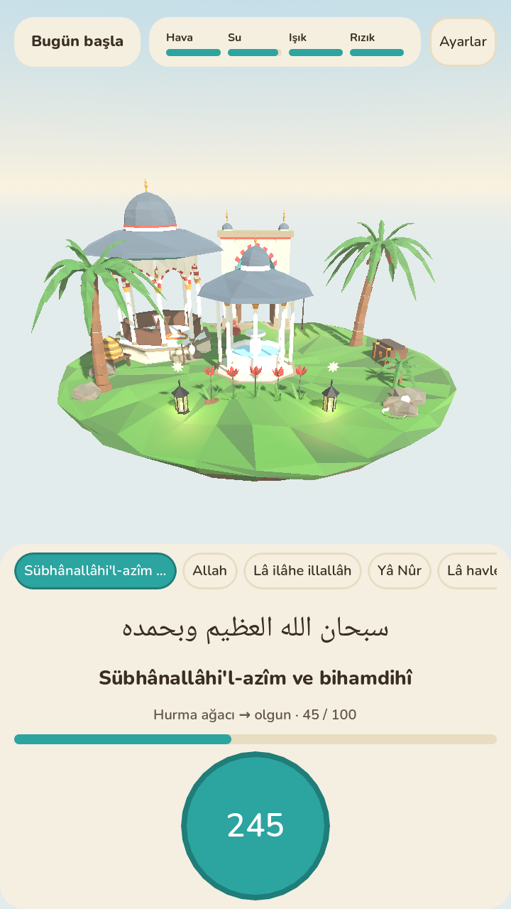

# Zikir Bahçesi

Söylenen her zikirle fidan dikilen bir bahçe oyunu. Hedef kitle 7-12 yaş ve aileleri.
Motor Godot 4.7. Bütün 3D modeller depodaki prosedürel model fabrikasında üretilir.



## Durum: Faz 1 (ilk oynanabilir dilim)

Hazır olanlar:
- **İçerik verisi.** Asset listesi (`docs/asset-listesi.md`) makinece okunur JSON'a çevrilir: 157 asset, 99+2 esma, 34 söz ve 15 tarif.
- **Oyun çekirdeği.** Kapsadığı konular:
  - aşama eşikleri (1, 10, 33, 100) ve açılıp kapanabilen ebced modu
  - ikinci item sırası, her 33 Sübhanallah'ta bir kuş, 10 kez üst üste salavat
  - cuma koşulu ve türeyen item'lar (sandıktan inci ya da mercan çıkar)
  - tarifler ve seri dondurmalı cezasız günlük seri
  - hiçbir zaman ölmeyen, yalnızca solan bahçe
  - atomik kayıt
- **Ses tanımaya hazır giriş katmanı.** `PhraseResolver`, iç içe geçen sözler bitmeden ödül vermez ("Sübhanallah" ile "Sübhanallahi ve bihamdihi" gibi).
- **Model fabrikası ve ilk 22 model.** MVP objeleri, bahçe kapısı, şadırvan, köşk, ada, hurma (4 aşama) ve lale (3 aşama). Hepsini [kontakt sayfasında](docs/goruntuler/modeller.png) görebilirsiniz.
- **Oynanabilir dilim.**
  - Açılışta temsil notu gösterilir ve oturum "Bismillah ile başla" düğmesiyle açılır; bahçe kapısı da bununla açılır.
  - Zikir seçilip dokunmatik tesbihle sayılır.
  - Bitkiler büyür, item'lar yerine konur ve her item için "Neden bu?" kartı çıkar.
  - Ayarlarda ebced modu açılıp kapanabilir.

Sonraki fazlar:
- Kalan MVP modelleri (canlılar dahil) ve VFX'ler.
- Mikrofon ve cihaz üstü KWS: sherpa-onnx ile Arapça doğruluk deneyi.
- Ebeveyn paneli, namaz vakti duraklatma, çoklu dil ve RTL, mobil export.

Kararlar: `docs/kararlar.md`. Danışma kurulu teyidi bekleyen maddeler: `docs/asset-listesi.md`, I bölümü.

## Klasörler

```
docs/                 rapor, asset listesi (tek kaynak), kararlar, ekran görüntüleri
tools/content/        asset listesi -> game/data/*.json
tools/model_factory/  prosedürel low-poly modeller -> game/assets/models/*.glb
tools/preview/        modellerin kontakt sayfası (three.js + Chromium)
game/                 Godot projesi
  core/               kurallar (sahneden bağımsız, test edilir)
  autoload/game.gd    tek giriş noktası: içerik, kayıt, olaylar
  input/              zikir giriş kaynakları (dokunmatik; mikrofon sonraki fazda)
  scenes/             bahçe, yerleşim, su shader'ı, ana sahne
  ui/                 arayüz ve tema
  tests/              bağımsız test koşucusu
```

## Komutlar

```sh
# İçerik: asset listesi değişince
python3 tools/content/build_content.py

# Modeller (numpy ve pygltflib gerekir: pip install numpy pygltflib)
python3 tools/model_factory/build_all.py            # hepsi
python3 tools/model_factory/build_all.py hurma      # adında "hurma" geçenler

# Model önizleme (bir kez: cd tools/preview && npm install)
node tools/preview/contact.mjs [filtre] [çıktı.png]

# Godot (4.7.2)
godot --headless --path game --import                        # içe aktarım
godot --headless --path game -s res://tests/run_tests.gd     # testler
godot --path game                                            # oyunu aç

# Geliştirici: örnek bahçeyle ekran görüntüsü (kayıt diske yazılmaz)
godot --path game -- --zb-senaryo=demo --zb-kartsiz=1 --zb-ekran=/tmp/bahce.png
```
